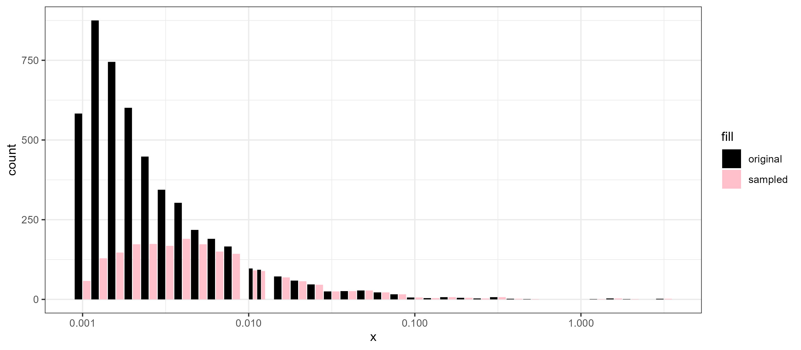

# VFP-Skewed-Power

###   

Investigating how under sampling small body sizes affects estimates of power law exponents (lambda). The repository name (Very Fast Picket Skewed Power) is inspired by ship names in the Culture Series by Iain M. Banks. 

## Introduction  

Power laws describe many phenomena in the natural and biological sciences. In ecology, a common pattern in biological communities is the rapid decline in abundance with increasing organismal body size. This pattern has received much attention in the literature and is known as size spectra, mass-abundance relationships, community biomass distributions. Here, we are specifically interested in constructing individual size distributions as defined by [White et al. 2007.](https://www.cell.com/ajhg/abstract/S0169-5347(07)00098-5). 

Maximum likelihood estimation (MLE) has been shown to be the most reliable and robust method for estimating parameters describing a power. However, empirical observations which are thought to follow a power law distribution often display undersampling of the smallest values, often attributed to artefacts from the collection techniques. For example, when sampling fish, the mesh sized used has a range of fish which it is optimized for. Fish which are too big are not effectively sampled because they are unable to enter the mesh in the first place, while fish that are too small are able to swim through the mesh without being captured. On the small end, there is a smooth decline in capture efficiencies where fish which are small, but not too small, are still captured but they are captured at lower rates than their true population densities would suggest. As the fish get smaller, the probability of capture declines until reaching zero. 

A common method in the literature is to estimate where the undersampling occurs (either mechanistically or using arbitrary but reasonable values) and to trim the data such that the minimum value is equal to the estimated value where under sampling begins. 

However, it remains unclear how much estimates of power law exponents are affected by undersampling of the smallest body sizes. 

Here, we use a simulation framework with repeated sampling to explore how under sampling may affect estimates of power law exponents. We sample body size values from a known distribution and then artificially under sample some range of small body sizes to investigate the deviance of estimates from the known values. Furthermore, we explore methods for correcting bias in estimates through trimming the data and using model estimates to "correct" the underlying observations. 

# Below this is from an earlier version  

* JPZ will re-write this once the simulation framework is confirmed.  

## Basic workflow  

1. A vector of $N$ body sizes, $X$ is sampled from a bounded power law.  
2. A vector of 1,000 body sizes, $X_{obs}$, is re-sampled from $X$ so that small body sizes are under sampled. 
3. $\hat \lambda_{obs}$ is estimated from the vector $X_{obs}$.  
4. $X_{obs}'$ is made by trimming $X_{obs}$ so that the smallest value ($x_{min}$) is $\gt$ the cutoff value, $\theta_c$. $\theta_c$ is either set beforehand or estimated automatically based on the "peak" of the observed data.   
5. $\hat \lambda'$ is estimated using $X_{obs}'$ data.  
6. Results of repeated simulation runs are compiled to produce distributions of $\hat \lambda_{obs}$ and $\hat \lambda_{obs}'$ and compared to the known value of $\lambda$ used in the original simulations.   

### $x_{min, model}$  
A separate analysis needs to be run for investigating the effects of the $x_{min, model}$ value.  

1. $x_{min, model} = \theta_c$  Use the smallest size in the "cut" data as the smallest size in the model to estimate $\lambda$ .  
2. $x_{min, model} = x_{min}$  Use the smallest known value. i.e., we know there is an individual of ~0.001 in this community, but we didn't sample it.  
3. $x_{min, model} = x_{min observed}$  Use the smallest value in the undersampled data, even though those values may be removed in the "cut" data to inform the model.  

How do we deal with the above in the "observed" data?  
* known minimum ~ 0.001  
* observed minimum (probably below the "peak")  
* global minimum; between 0.001 and the peak?

## Variables and quantities  

| Variable  | Brief Description |
|  :----:   |:------------------|
| $\lambda$ |The exponent of the power law. Steeper values (more negative) result in a faster decline in abundance of large body sizes. Shallower values (closer to 0) have a slow decline in the largest body sizes. |
| $\hat \lambda$ | The estimated value for the bounded power law exponent | 
| $X$  | A vector of body sizes sampled from a bounded power law defined by $\lambda$. The bounds are defined by $x_{min}$ and $x_{max}$ |
| $X_{obs}$| Observed $X$ values. A subset of the vector $X$ which has small body sizes undersampled. |
|$X_{obs}'$| The observed $X$ values with the tail "cut" to remove the undersampled body sizes. |
| $x_{min}$ | The minimum body size in $X$ |
| $x_{max}$ | The maximum body size in $X$ |
|$N_x$| The number of individual body sizes originally sampled from a bounded power law. Default value = 10,000 |
|$N_{x, obs}$| The number of individuals in the "observed" vector of body sizes. $N_{x, obs} < N_x$ and is used to undersample small sizes. Default value = 1,000|
| $\theta$  | The threshold indicating where undersampling of small sizes begins. $X$ values $\le \theta$ are undersampled relative to what would be expected in a "true" bounded power law described by $\lambda$ |
| $\theta_c$ | The threshold value indicating where data is "cut". $X$ values $\gt$ greater then $\theta_c$ are kept and values below $\theta_c$  are removed before power law exponents are estimated ($\hat \lambda$. |
| $\psi$ | The probability of values below $\theta$ being sampled. Initial simulations used a set value (i.e., all $X \le \theta$ only have a 5% chance of being sampled. Future versions will attempt to functionalize this such that the probability of being sampled declines as $X$ decreases. |
|$i$| subscript representing a unique combination of parameter values used in each simulation. |
|$N_{rep}$|The number of replicates for each set of simulation parameters. Defaults to 1000|
|$j$| Subscript indicating the replicate run ($j = 1...N_{rep}$) for each simulation set $i$. |
